# Kinopoisk Random Movie Telegram Bot

This project is a Telegram bot that helps users discover random movies using data from the Kinopoisk website (www.kinopoisk.ru).

## Description

The bot combines a Kinopoisk parser with a Telegram interface, allowing users to easily get  random movies through a chat interface. It uses Selenium WebDriver and BeautifulSoup for web scraping, and Telegram bot library (aiogram) for the bot functionality.

You can check how it works on YouTube https://youtu.be/Y5h_AVFvHJw

I don't want to buy hosting for this project

## Important Note on Movie Selection

When users select multiple genres or countries, it's important to understand that Kinopoisk's random selection process works as follows:

- The website randomly selects ONE genre and/or ONE country from the user's input list.
- This means that if a user selects multiple genres (e.g., Horror and Thriller), the resulting movie might belong to only one of these genres (e.g., it could be just a Horror movie without Thriller elements).
- The same applies to country selection.

This behavior is inherent to Kinopoisk's system and not a limitation of the bot itself.

## Main Features

1. **Random Movie**
   - Users can request a completely random movie suggestion.

2. **Filtered Movie**
   - Users can specify genres and countries to get more targeted movie suggestions.

3. **Movie Information Display**
   For each suggested movie, the bot provides:
   - Movie title
   - Genre
   - IMDb rating
   - Brief description
   - Movie poster (if available)

## Components

1. **Kinopoisk Parser**
   - `ParsSettings`: Contains basic settings and dictionaries for genres and countries.
   - `Driver`: Manages Selenium WebDriver for web interactions.
   - `GetRandomMovieData`: Extracts and processes movie data from Kinopoisk.

2. **Telegram Bot Interface**
   - Implements an intuitive button-based interface for user interactions.
   - Handles user selections and processes requests.
   - Presents movie information in a user-friendly format.

## How It Works

1. Users start the bot and are presented with the main keyboard.
2. Based on the user's selection, the bot presents additional options or fetches a movie.
3. For genre or country selection, users can choose from predefined lists.
4. The bot uses the selections to query the Kinopoisk parser and return movie information

## Bot Interface Examples
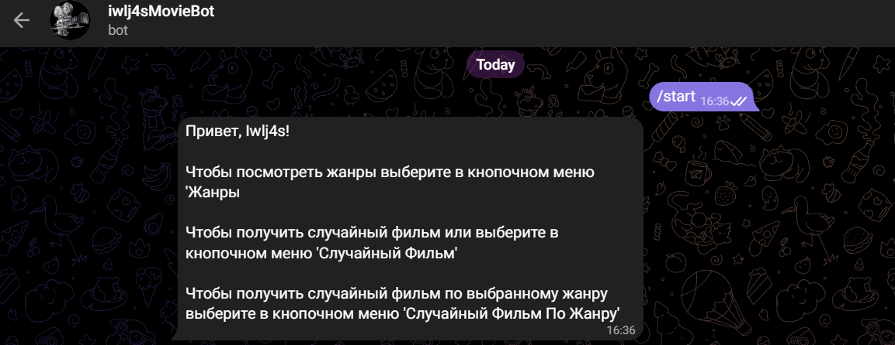

### 1. Random Movie Selection
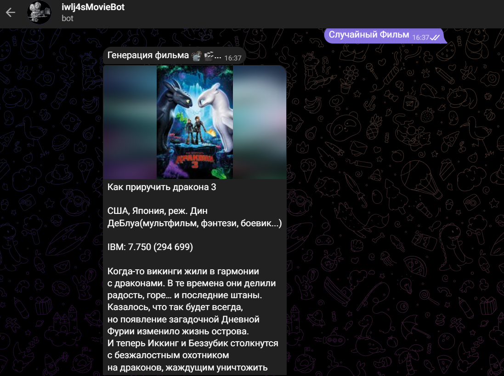

### 2. Movie Selection with Chosen Genre (No Country Specified)

   * **Movie by genre button**
      
   
   * **Choose genre/genres**
   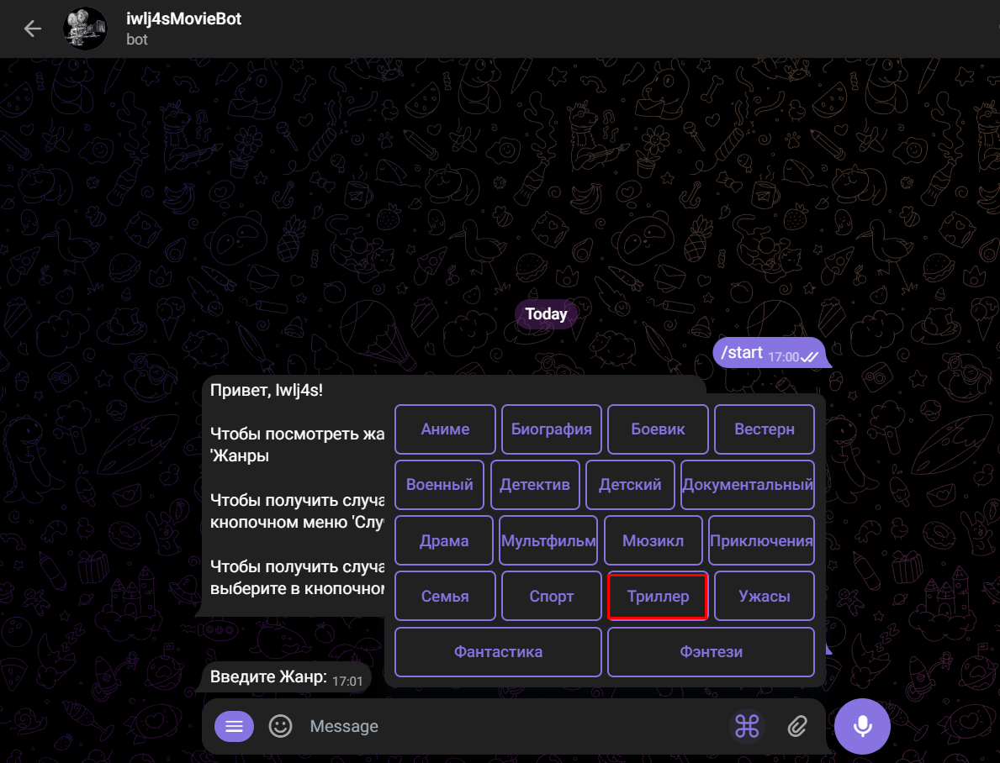

      Do you want to choose one more genre? (We choose yes)
      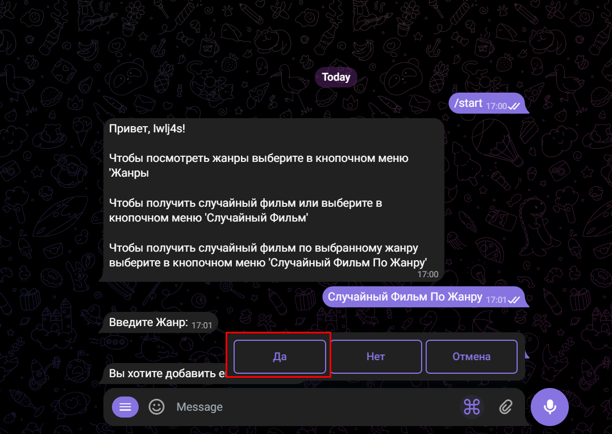

   * **Choose country/countries (we skip it)**
   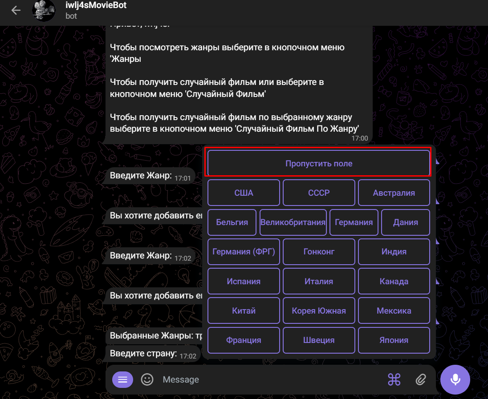
   
   * **Generate movie? (we choose yes)**
   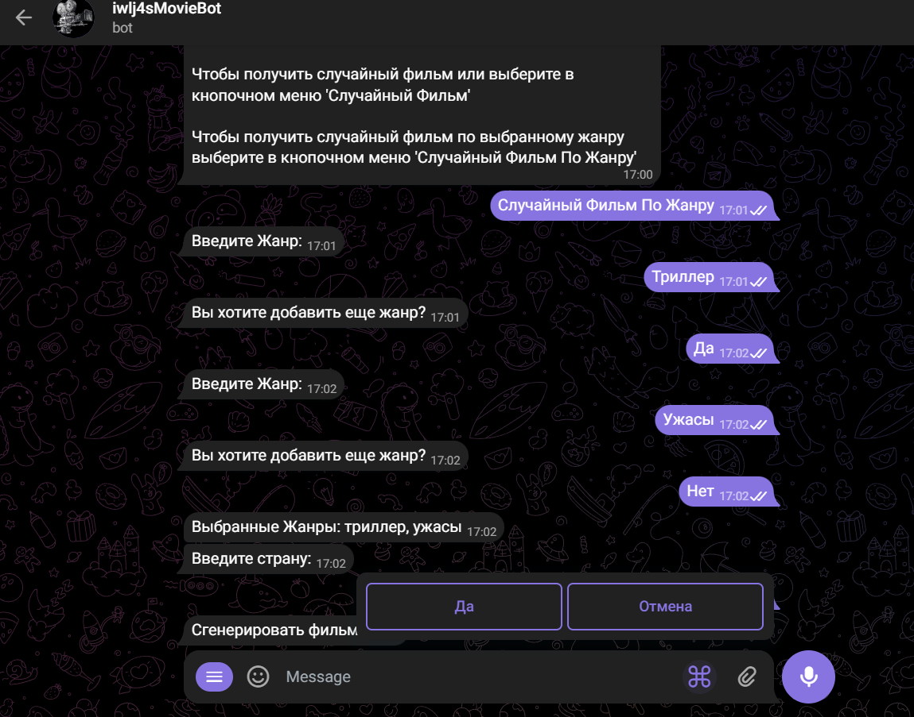

   * **Result**
   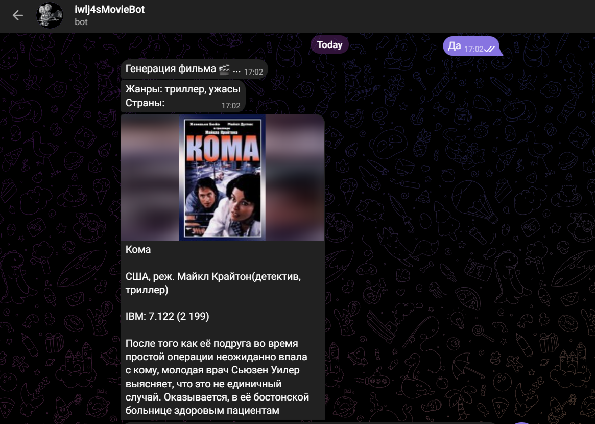

### 3. Movie Selection with Chosen Genre and Country
   * **Movie by genre button**
      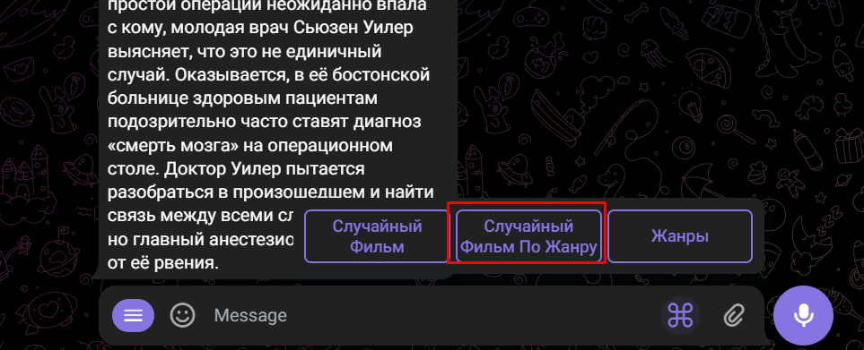
   
   * **Choose genre/genres**
   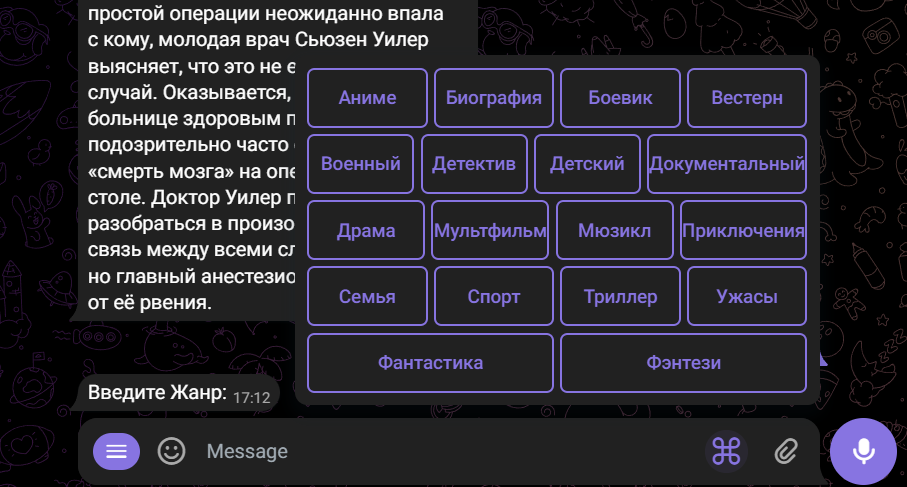
      Do you want to choose one more genre? (We choose yes)
      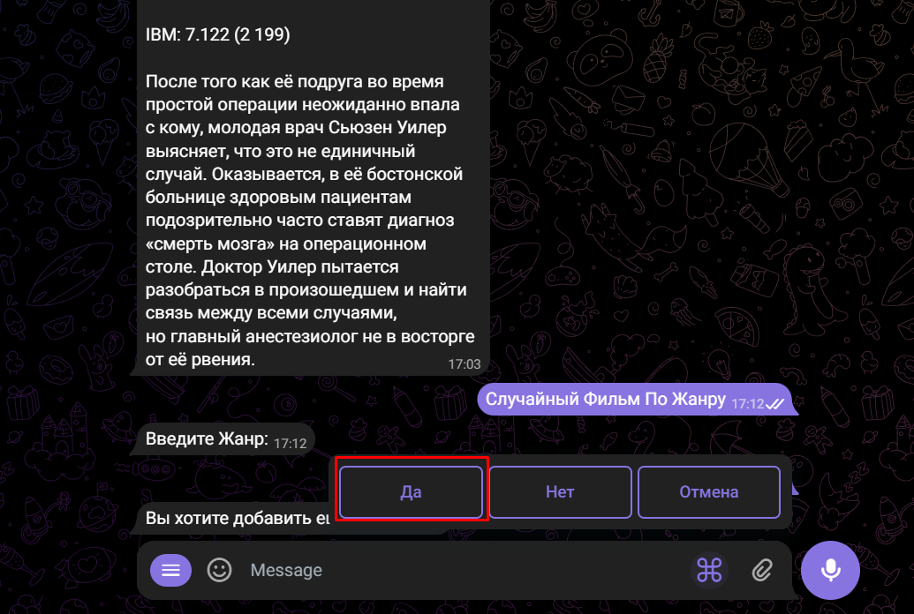

   * **Choose country/countries**
   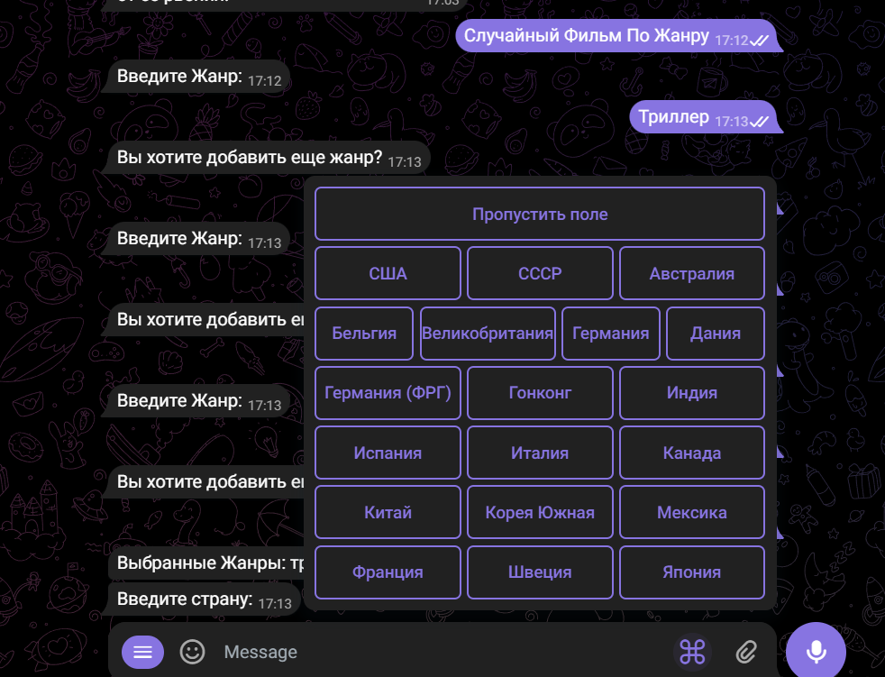
      Do you want to choose one more country? (We choose yes)
      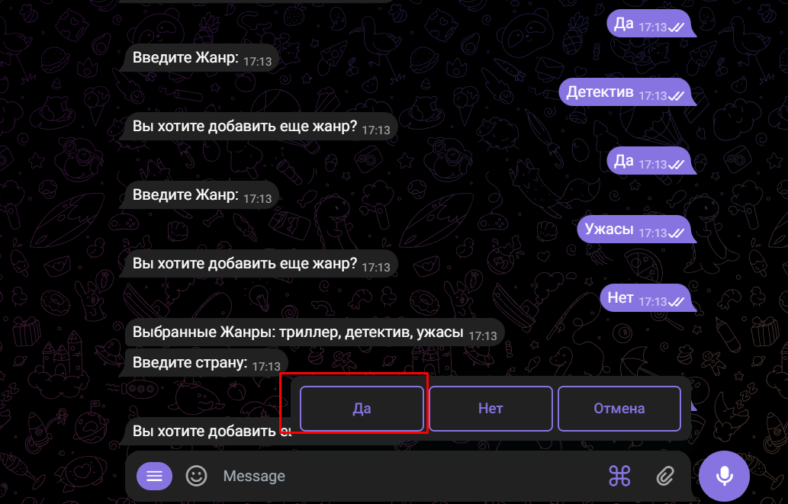
   
   * **Generate movie? (we choose yes)**
   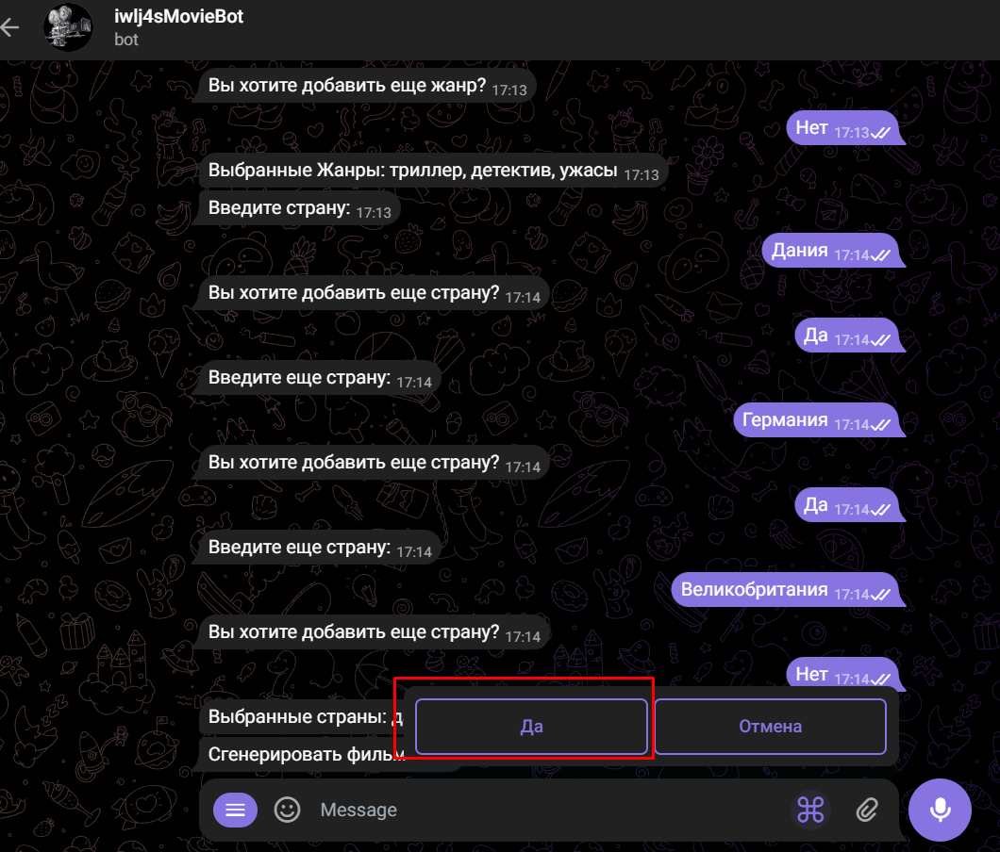

   * **Result**
   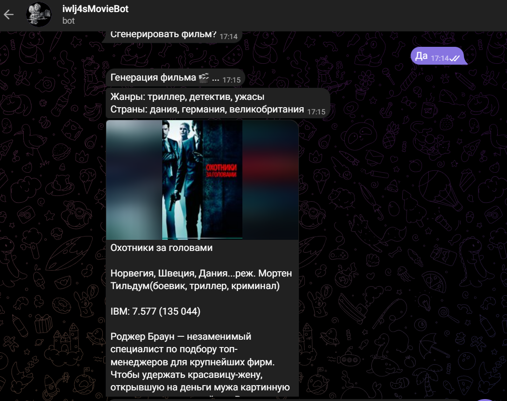

